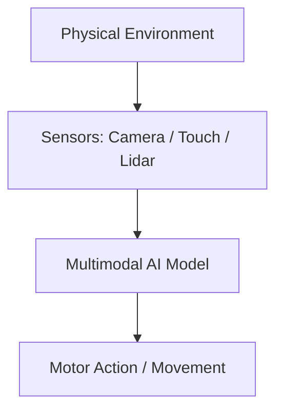

# Embodied & Multimodal Grounding

Embodied and Multimodal Grounding links language representation to sensorimotor systems and physical actions. Used in robotics and computer vision, it connects language tokens directly to visual feeds, physics engines, spatial maps, and mechanical controls.

## How It Works

1. **Multimodal Sensing**: The agent observes the physical environment using cameras, touch sensors, LiDAR, etc.
2. **Text Alignment**: The agent maps linguistic commands (e.g., "pick up the red mug") to visual features and spatial coordinates.
3. **Execution & Interaction**: The model outputs motor controls to physical actuators to interact with the environment, verifying language statements through physical feedback.

## Flow Diagram

## Key Applications

- **Autonomous Robotics**: Enabling robots to understand natural language instructions and carry them out in physical space.
- **Multimodal LLMs (LMMs)**: Grounding images, video, and audio to text coordinates for comprehensive multimodal reasoning.
- **Virtual Environments & Simulation**: Training agents in physics engines to learn spatial navigation and manipulation task grounding.
