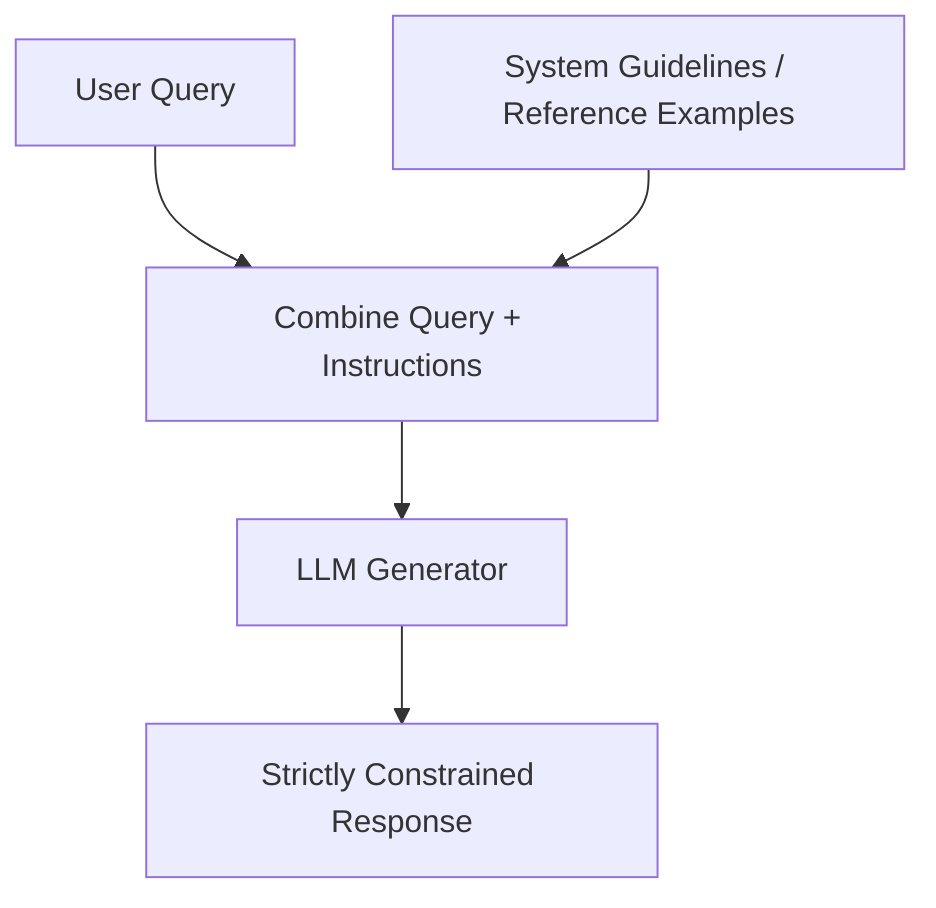

# In-Context Prompt Grounding

In-Context Prompt Grounding feeds authoritative guidelines, examples (few-shot learning), and static reference files directly into the prompt's context window. This method binds the model's output strictly to the provided text boundaries without requiring retrieval or dynamic updates.

## How It Works

1. **System Definition**: Developers prepopulate system prompts with constraints, rules, and examples.
2. **Context Pinned**: Crucial reference information is pinned to the beginning of the prompt.
3. **Execution**: The model responds to the user's input while staying within the boundary of the pinned context.

## Flow Diagram

## Key Benefits

- **Simplicity**: No external database infrastructure or search engines required.
- **Strict Compliance**: Pinned rules force the model to adhere closely to stylistic and safety guidelines.
- **Low Latency**: Avoids retrieval steps during live inference.
