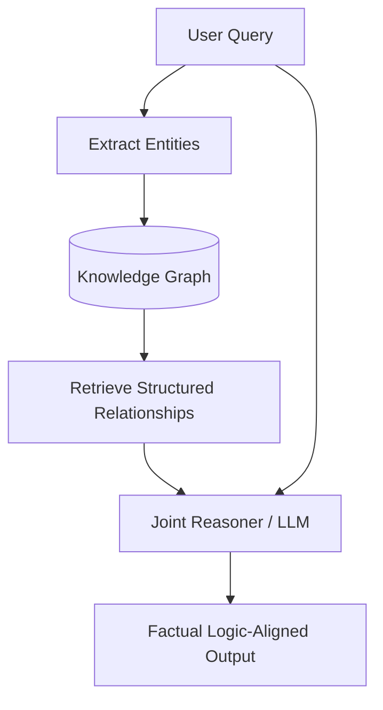

# Knowledge Graph Grounding

Knowledge Graph Grounding links natural language models to structured symbolic knowledge representations. It maps unstructured text to nodes and edges in a graph, allowing models to retrieve explicit, deterministic relationships instead of making statistical guesses.

## How It Works

1. **Entity Extraction**: The query is parsed to identify key entities and concepts.
2. **Graph Querying**: The system queries a Knowledge Graph (e.g., Neo4j, Wikidata) for the extracted entities and their adjacent nodes/relationships.
3. **Context Construction**: The retrieved subgraphs are serialized into text or structured formats.
4. **LLM Reasoning**: The LLM uses these deterministic relationship paths to reason and generate a factually accurate, structured response.

## Flow Diagram

## Key Benefits

- **Strict Logic Rules**: Prevents models from guessing connections by forcing them to follow explicit graph edges.
- **Explainability**: Allows trace-back of reasoning paths directly to facts in the graph database.
- **Symbolic & Connectionist Hybrid**: Combines the strengths of neural reasoning (LLMs) with relational rules (KGs).
