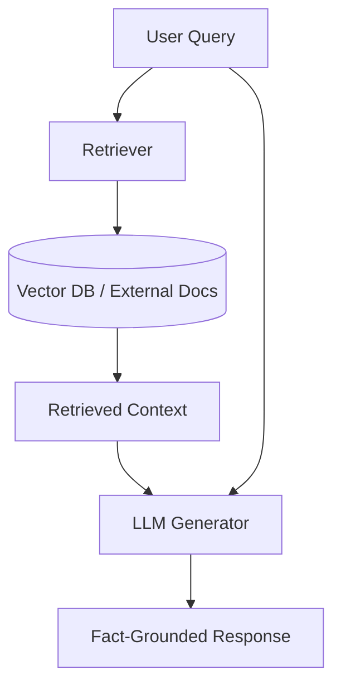

# Retrieval-Augmented Generation (RAG)

Retrieval-Augmented Generation (RAG) is an architectural pattern that optimizes the output of a Large Language Model (LLM) by referencing an authoritative, external knowledge base outside of its training data sources before generating a response.

## How It Works

1. **Ingestion**: Documents are chunked, embedded into vector representations, and indexed in a vector database.
2. **Retrieval**: When a user submits a query, the system embeds the query and retrieves the most semantically similar chunks from the vector database.
3. **Augmentation**: The retrieved text chunks are combined with the user query and inserted into the LLM prompt.
4. **Generation**: The LLM uses the prompt context to generate a factual, grounded response.

## RAG Flow Diagram

## Key Benefits

- **Reduction of Hallucinations**: Constrains the model's response to retrieved facts.
- **Up-to-Date Information**: Allows access to real-time updates without retraining the model.
- **Source Attributability**: Enables linking the output directly to source documents.
