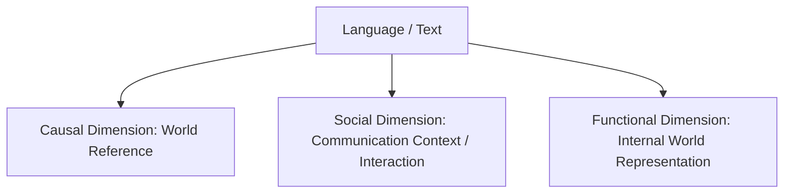

# Semantic Grounding

Semantic Grounding is explored in AI philosophy to evaluate whether artificial models possess "genuine understanding" of language. As defined in Holger Lyre's 2024 work, semantic grounding can be broken down into functional, social, and causal dimensions.

## Dimensions of Grounding

- **Functional Grounding**: Internal representations and operational capacities, such as the LLM's capacity to build coherent internal "world models" and solve tasks.
- **Social Grounding**: Adapting to communicative norms and social contexts (language games), referencing language's role in human-to-human/human-to-machine interactions.
- **Causal Grounding**: The relationship between model symbols and physical/causal realities, often mediated indirectly via massive training datasets that encode causal truths about the world.

## Flow Diagram

## Key Applications

- **AI Philosophy**: Framing debate on whether LLMs are just "stochastic parrots" or possess genuine understanding.
- **Evaluation Frameworks**: Assessing how deep neural nets model physical processes and logical concepts.
- **Interpretability**: Investigating the emergence of factual world models in neural activations.
