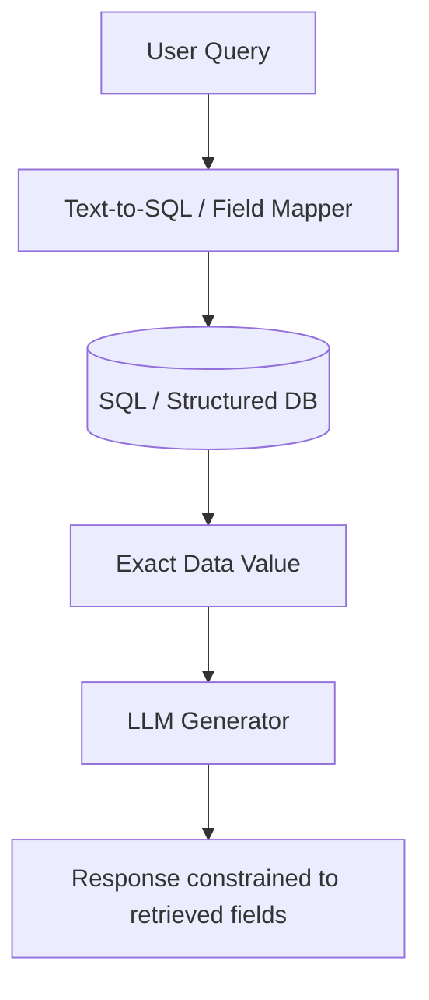

# Structured Data Lookups

Structured Data Lookups constrain an AI's data access to specific, rigid, and well-defined columns, tables, or database fields. This prevents models from interpreting data fields loosely and forces exact matches for critical metrics like inventory counts, prices, or status fields.

## How It Works

1. **Query Translation**: The user input is parsed and mapped to structured query parameters (or SQL/GraphQL queries).
2. **Database Execution**: The database processes the query to return precise data cells rather than free-form text.
3. **Template Formatting / LLM Constraint**: The returned values are formatted strictly and provided directly to the model as an absolute constraint.

## Flow Diagram

## Key Benefits

- **High Precision**: Avoids misinterpretations of tabular data or numbers.
- **Access Control**: Restricts the model's access only to authorized database fields.
- **Integration with Relational Systems**: Directly connects modern AI with classic business databases.
