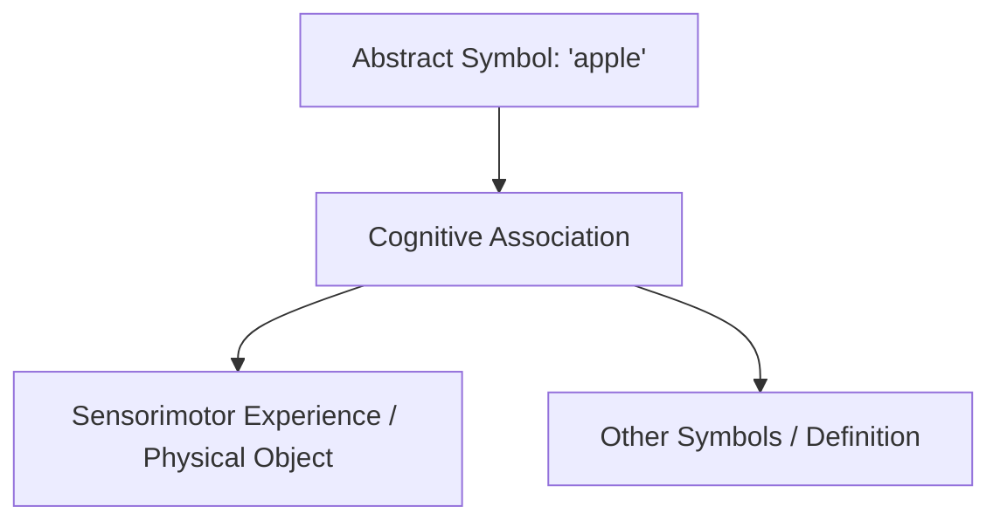

# Symbol Grounding

The Symbol Grounding Problem is a classic cognitive science and AI philosophy challenge proposed by Stevan Harnad in 1990. It addresses how abstract symbols (like words or code) obtain physical meaning, rather than merely referencing other symbols (like words in a dictionary).

## How It Works

1. **Purely Symbolic Representation**: A system processes symbols based on syntax rules (e.g., matching text tokens).
2. **Sensorimotor Association**: The system links symbols to perceptual data (sounds, visual patterns, actions).
3. **Grounding**: The meaning of symbols is anchored in the physical world via sensory interactions.

## Flow Diagram

## Key Applications

- **Cognitive Architecture**: Understanding how human minds build conceptual systems.
- **Natural Language Semantics**: Evaluating whether AI models truly "know" what a word refers to, or if they only map syntax patterns.
- **Physical Representation**: Creating models that link linguistic symbols to direct physical objects.
