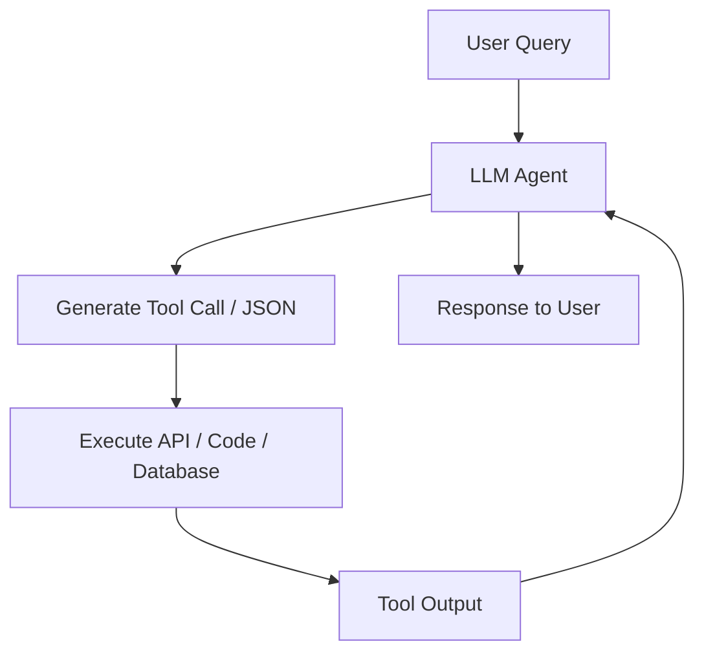

# Tool & Function Calling

Tool and Function Calling enables Large Language Models to interact with external APIs, databases, and systems. Rather than relying solely on text generation, the model can output a structured payload (such as JSON) containing arguments for calling specific tools.

## How It Works

1. **System Prompt & Tool Definitions**: The model is provided with descriptions of available tools (APIs, calculators, database querying tools) along with their expected parameters.
2. **Analysis**: The LLM parses the user query and decides which tool is required to obtain the answer.
3. **Execution**: The LLM generates a structured function call payload (e.g. JSON), which is executed by the hosting application.
4. **Integration**: The result of the tool execution is fed back to the LLM as context to formulate the final response.

## Flow Diagram

## Key Benefits

- **Access to Live Data**: Triggers database queries or API endpoints dynamically (e.g., live weather, stock market data).
- **Execution Capability**: Solves complex mathematical computations, runs code, and interfaces with existing enterprise software.
- **Agentic Workflows**: Forms the basis of modern autonomous AI agents.
